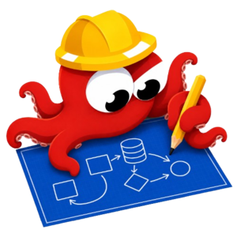
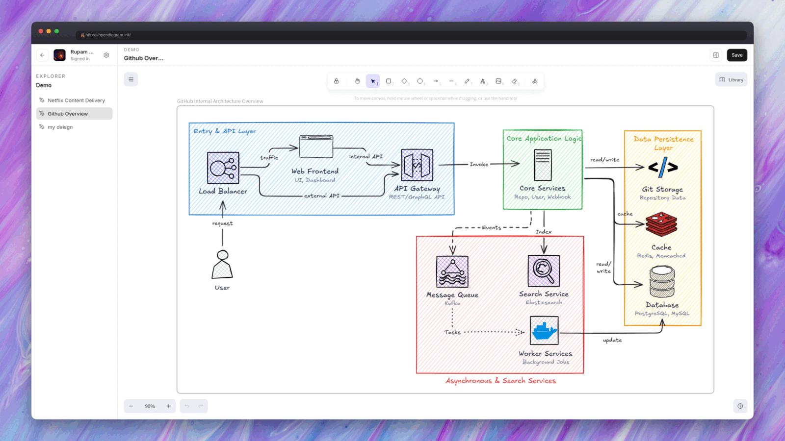

<div align="center">



<h1 align="center">OpenDiagram</h1>

<h3 align="center">The open-source AI diagram generator for software architecture</h3>

<p align="center">
  <strong>Describe your system in plain English. Get editable architecture, sequence, ERD and cloud diagrams on a real <a href="https://github.com/excalidraw/excalidraw">Excalidraw</a> canvas.</strong>
</p>

<p align="center">
  An open-source alternative to Eraser.io and DiagramGPT - self-hostable, bring your own key, and it never outputs Mermaid.
</p>

<p align="center">
  <a href="./LICENSE"></a>
  <a href="https://github.com/Itz-Agasta/OpenDiagram/stargazers"></a>
  <a href="https://www.typescriptlang.org/"></a>
  <a href="https://bun.sh"></a>
  <a href="#contributing"></a>
</p>

<p align="center">
  <strong><a href="https://opendiagram.ink">Try it live</a></strong>
  ·
  <a href="#getting-started">Getting Started</a>
  ·
  <a href="#opendiagram-vs-other-ai-diagram-tools">Comparison</a>
  ·
  <a href="#faq">FAQ</a>
  ·
  <a href="#contributing">Contributing</a>
</p>



</div>

---

## What is OpenDiagram?

OpenDiagram is a free, open-source **AI diagram generator** built for engineers. Type a prompt like _"Design a microservices architecture for an e-commerce platform on AWS"_ and an AI agent designs the system, then draws it as clean, editable shapes on an Excalidraw whiteboard.

It is **vibe diagramming** for software architecture: describe the system, look at it, refine it in conversation - the same loop vibe coding gave you for code, applied to design.

Most AI diagram tools stop at generating Mermaid syntax. OpenDiagram doesn't. The AI emits a typed, semantic spec; a deterministic layout engine and renderer own every pixel. That is why the output looks like a senior engineer drew it instead of like generated boxes.

## Why OpenDiagram?

Engineering teams scatter design work across tools: diagrams in one app, docs in another, ADRs in a wiki, and an AI chat that forgets everything between sessions.

- **Not Mermaid.** The AI outputs a typed `DiagramSpec`, and it never chooses pixels, colors or fonts. A layout engine ([ELK](https://github.com/eclipse/elk)) and themed renderer turn that spec into styled Excalidraw elements - real AWS/GCP/Kubernetes icons, orthogonal arrows, consistent typography. LLMs decide _what_, code decides _how it looks_.
- **A real canvas, not a PNG.** Everything lands on an open Excalidraw whiteboard. Move things, restyle them, add notes. New diagrams land beside your work instead of wiping it.
- **Memory that persists.** Project context, design decisions and diagram state survive across sessions. Ask "why did we pick Kafka?" next week and get a real answer.
- **Conversational iteration.** _"Add a Redis cache between the gateway and the product service"_ updates the diagram in place.
- **Bring your own key.** Plug in your own OpenAI, Anthropic, Google or OpenRouter key. Keys are encrypted at rest and never leave your instance.
- **Open and self-hostable.** Apache 2.0. Run the whole stack on your own infrastructure.

## Features

### AI architecture diagram generation

- **System design & cloud architecture diagrams** - card nodes with real AWS, GCP and Kubernetes icons, VPC/cluster grouping, labeled protocol arrows
- **Sequence diagrams** - lifelines, numbered messages, dashed replies, red error paths, green confirmations, UML `alt`/`loop` fragments
- **ER diagrams (ERD)** - entity tables with typed columns, PK/FK markers, crow-foot relationship notation
- **Flowcharts, network and infrastructure diagrams**

### Two visual themes

- **Sketch** - hand-drawn Excalifont look with hachure fills, straight from a whiteboard session
- **Classic** - crisp architectural style: white cards, solid fills, eraser-style discipline

### An agent, not a form

The chat agent asks a clarifying question when your request is ambiguous, streams its design plan, draws via tools, and self-corrects invalid output. It knows what is already on your canvas.

### Bring your own AI provider

Ship your own key for **OpenAI, Anthropic, Google or OpenRouter**, pick the model per project, and keep your usage on your own billing. No provider lock-in.

### Workspace

Projects, files, a docs editor, GitHub repo import, and guest mode - try everything without an account.

## OpenDiagram vs other AI diagram tools

|                           | **OpenDiagram**            | Eraser.io / DiagramGPT | draw.io | Mermaid   | Lucidchart  |
| ------------------------- | -------------------------- | ---------------------- | ------- | --------- | ----------- |
| Open source               | ✅ Apache 2.0              | ❌                     | ✅      | ✅        | ❌          |
| Self-hostable             | ✅                         | ❌                     | ✅      | ✅        | ❌          |
| AI generation from text   | ✅                         | ✅                     | Plugin  | External  | ✅          |
| Output format             | Native Excalidraw elements | Proprietary            | XML     | Mermaid   | Proprietary |
| Editable after AI draws   | ✅ full canvas             | ⚠️ AI-only             | ✅      | Text only | ✅          |
| Bring your own AI key     | ✅                         | ❌                     | -       | -         | ❌          |
| Persistent project memory | ✅                         | ❌                     | ❌      | ❌        | ❌          |
| Free                      | ✅                         | Limited credits        | ✅      | ✅        | Limited     |

## Getting Started

Try it instantly at **[opendiagram.ink](https://opendiagram.ink)** - no account needed. Or self-host the whole thing:

**Prerequisites:** [Bun](https://bun.sh) 1.3+ and a PostgreSQL database.

```bash
git clone https://github.com/Itz-Agasta/OpenDiagram.git
cd OpenDiagram
just reinstall

cp .env.sample apps/server/.env
cp .env.sample apps/web/.env    # then fill in values in both
bun run dev
```

Web runs on `:3001`, API on `:3000`, docs on `:4000`. Open <http://localhost:3001>, create a project (no login needed), and ask for a diagram.

## Roadmap

- [x] Interactive Excalidraw whiteboard
- [x] AI diagram generation (system design, cloud, flowchart)
- [x] Sequence diagrams (lifelines, fragments, error/success paths)
- [x] ER diagrams (entity tables, crow-foot notation)
- [x] Diagram templates
- [x] Project memory & docs generation
- [x] Bring Your Own Key (OpenAI, Anthropic, Google, OpenRouter)
- [ ] Export presets (PNG / SVG / `.excalidraw`)
- [ ] Position-locked incremental updates
- [ ] Team collaboration & version history
- [ ] MCP server support

## FAQ

### Is there an open-source alternative to Eraser.io?

Yes - OpenDiagram. It is Apache 2.0 licensed, self-hostable, and generates system architecture, sequence and ER diagrams from natural language. Unlike Eraser, the output is native Excalidraw elements you fully own and can edit anywhere.

### Can AI generate architecture diagrams from text?

Yes. OpenDiagram takes a plain-English description of a system and produces a laid-out architecture diagram with real cloud provider icons, grouped boundaries and labeled connections. Ambiguous prompts get a clarifying question instead of a wrong guess.

### How is this different from AI tools that generate Mermaid?

Mermaid-based tools hand the LLM a text syntax and let its renderer decide the layout, so you get generic boxes and arrows that engineers redraw by hand. OpenDiagram separates concerns: the LLM only decides _what_ the system contains, and a deterministic layout engine plus a themed renderer decide _how it looks_.

### What is vibe diagramming?

Vibe diagramming is describing a system, flow or process in plain language and letting AI render it instantly, then iterating conversationally instead of dragging shapes. OpenDiagram is the open-source, engineer-focused take on it - built for architecture diagrams specifically, not generic charts.

### Can I self-host OpenDiagram?

Yes. The entire stack - Next.js web app, Hono API and diagram engine - is Apache 2.0 and runs on your own infrastructure. You supply your own database and AI provider key.

### Which AI models are supported?

OpenDiagram is provider-agnostic. Bring your own key for OpenAI, Anthropic, Google or OpenRouter, and pick the model per project.

### Is OpenDiagram free?

Yes, and it always will be. Apache 2.0, no open-core tricks on the diagram engine.

## Contributing

Contributions are welcome - bug fixes, themes, icon packs, layout improvements, docs. Start with [CONTRIBUTING.md](./CONTRIBUTING.md) for setup, project layout and code style, then open a PR.

Working on layout or rendering? Read [`packages/harness/README.md`](./packages/harness/README.md) first - the diagram engine has rules that are easy to trip over.

Found a security issue? Please follow [SECURITY.md](./SECURITY.md) instead of opening a public issue.

## License

[Apache License 2.0](./LICENSE)

---

<div align="center">

<p align="center">
  <strong>If OpenDiagram saved you an hour of dragging boxes, consider starring the repo ⭐</strong>
</p>

<p align="center">
  <a href="https://github.com/Itz-Agasta/OpenDiagram/stargazers"></a>
</p>

<p align="center">
  Built with <a href="https://github.com/excalidraw/excalidraw">Excalidraw</a>, <a href="https://github.com/eclipse/elk">ELK</a>, <a href="https://nextjs.org">Next.js</a> and <a href="https://bun.sh">Bun</a>.
</p>

</div>
